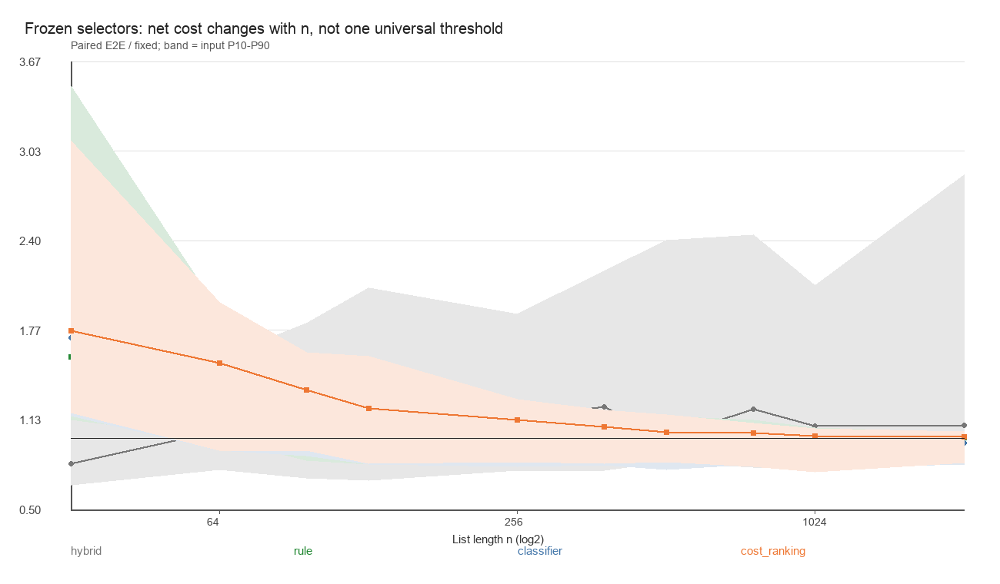
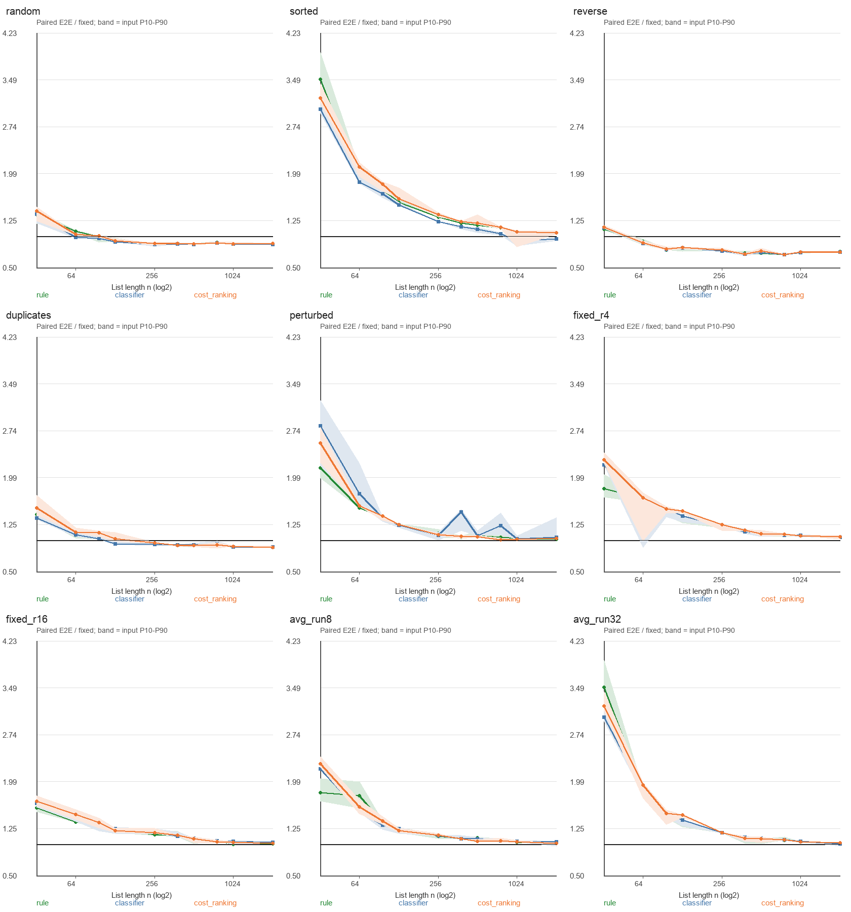
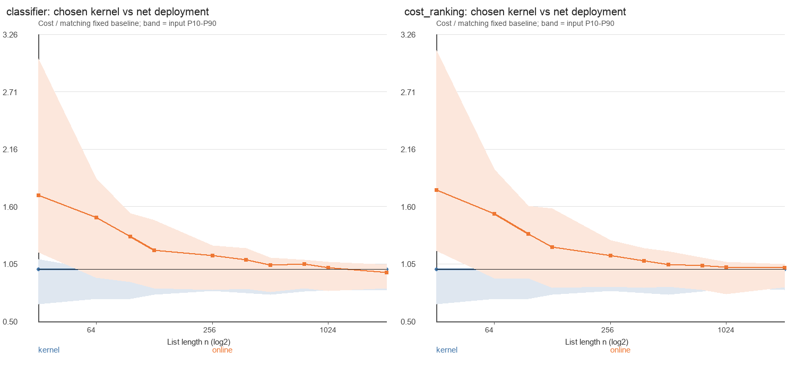
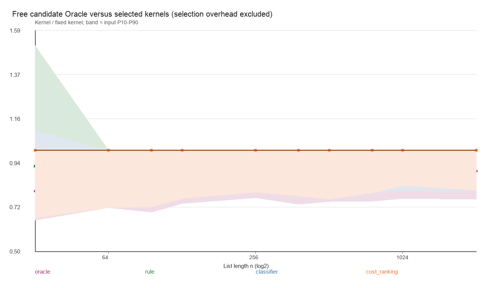

# 在线选择：尺度诊断与低预算特征对照

两阶段均结束；最终人工判读见同目录 interpretation.zh.md。以下统计从全部保存记录产生，非最优性或普遍阈值证明。

## 范围与纪律

正式长度 [32, 64, 96, 128, 256, 384, 512, 768, 1024, 2048]；请求上限 46 秒，采样 RSS 2816 MiB，栈 8 MiB。A/B 预算 360/600 秒。由独立 pilot 的请求耗时／RSS 决定，未按相对收益筛数据。
未执行扩展：[{'n': 4096, 'status': 'not_executed_pilot_budget_forecast', 'estimated_a_seconds': 325.2097354860001}, {'n': 8192, 'status': 'not_executed_pilot_budget_forecast', 'estimated_a_seconds': 646.5186656819997}, {'n': 16384, 'status': 'not_executed_pilot_budget_forecast', 'estimated_a_seconds': 646.5186656819997}]；A 状态 {'ok': 282}。未返回成本均为 null，原始局部事件保留，不填零。
同源派生输入整组划分；完全相同输入合并并保留别名，计时重复不当独立输入。图示输入间波动并非独立同分布置信区间，同组形态相关。
控制输入的固定 r=4/16、平均段长约 8/32 使用段间严格下降且值域分离的有序块；固定 n=512 改变 r 和均衡／偏斜程度。另有随机、逆序、重复、有序、局部扰动。真实 runs 在 Lean 和独立扫描中核对，不向选择器提供边界。控制设计不能代表所有具有相同 r 的自然输入。
A 不训练、不改阈值，使用上一轮原 Worker、原最终模型和规则。B 与 A、历史输入隔离；所有策略使用相同直接 List 内核、Nat 比较器、Lean --run 编译方式和输出消费。

## A：冻结策略的净成本随长度变化

每输入三轮中位数之和 / 固定 runs_count；小于 1 为本次更快。
| n | 完成输入 | Hybrid-8 | 旧规则 | 分类树 | 成本树 |
|---:|---:|---:|---:|---:|---:|
| 32 | 21 | 0.8460 | 1.5755 | 1.6352 | 1.6705 |
| 64 | 27 | 0.9960 | 1.3167 | 1.2604 | 1.2744 |
| 96 | 27 | 1.0091 | 1.1335 | 1.1296 | 1.1686 |
| 128 | 21 | 0.9504 | 1.0415 | 1.0343 | 1.0668 |
| 256 | 27 | 1.0180 | 0.9834 | 0.9796 | 0.9972 |
| 384 | 27 | 1.0946 | 0.9591 | 0.9843 | 0.9545 |
| 512 | 24 | 1.0363 | 0.9355 | 0.9365 | 0.9434 |
| 768 | 27 | 1.1355 | 0.9518 | 0.9672 | 0.9329 |
| 1024 | 27 | 1.0651 | 0.9228 | 0.9194 | 0.9237 |
| 2048 | 27 | 1.0964 | 0.9203 | 0.9315 | 0.9204 |

观测网格后缀交叉点 {'rule': 256, 'classifier': 256, 'cost_ranking': 256}：此格及更大已完成格点汇总比值均 <1，末端孤立格点也可能入选。**这不是稳定临界点**；缺失格点、输入形态和逐输入退化仍需分别解释。

| 策略 | E2E ms | /固定 | 所选内核 ms | 推理诊断 ms | 配对中位数 / P90 |
|---|---:|---:|---:|---:|---|
| fixed | 121.582 | 1.0000 | 121.140 | 0.112 | 1.000 / 1.000 |
| hybrid | 131.475 | 1.0814 | 130.784 | 0.093 | 1.096 / 2.028 |
| rule | 114.748 | 0.9438 | 109.006 | 0.165 | 1.075 / 1.560 |
| classifier | 115.643 | 0.9512 | 110.213 | 0.228 | 1.067 / 1.581 |
| cost_ranking | 114.678 | 0.9432 | 108.709 | 0.523 | 1.073 / 1.591 |

候选免费 Oracle 内核 106.963 ms；固定内核 121.140 ms。Oracle 只在已冻结七候选中按实测时间选择，不计在线成本，不是可部署／全局最优算法。
图的横轴为 log2 长度，线是逐输入配对比值中位数，带为输入间 P10–P90，而不是重复轮的区间；图与总时间比的权重不同。曲线 CSV 和每输入 paired.jsonl 同时保存。









## B：有界特征预算、真实重训与独立确认

length 只用长度；8/16 每探针只做一次相邻键 ≤，提供长度、探针数和下降率，其他槽为不可用零；legacy 是旧六特征／最多 80 次键比较。每预算中规则和模型得到相同向量。
List.length 与到达分散探针仍需遍历；指针单调推进，不为每个探针独立从表头索引。固定比较预算不是 O(1) 时间。提取、算术、分配、推理、分派、排序及完整输出消费都在 E2E 内；没有缓存／复用 runs。
每预算训练分类树和相对成本回归树，深度 2/4、叶下限 8，共 16 个模型；规则从预先规定的长度阈值 32/128、下降率阈值 125/250 中选，共 16 个规则。只用独立验证 E2E 选配置。
冻结于 2026-09-08T02:34:14.084281+00:00，随后生成确认集。验证选出的整体预算 {'classifier': 'sixteen-classifier', 'cost_ranking': 'sixteen-cost_ranking', 'rule': 'sixteen-rule'}；所有预算结果也报告，不按确认结果重选赢家。

| 配置 | 确认 E2E ms | /固定 | /同预算规则 | 特征比较 | 内核比较 |
|---|---:|---:|---:|---:|---:|
| fixed | 74.052 | 1.0000 | — | 0 | 435,418 |
| hybrid | 80.908 | 1.0926 | — | 0 | 529,581 |
| length-classifier | 74.390 | 1.0046 | 0.9979 | 0 | 437,188 |
| length-cost_ranking | 74.633 | 1.0079 | 1.0012 | 0 | 435,809 |
| length-rule | 74.544 | 1.0067 | — | 0 | 437,188 |
| eight-classifier | 67.976 | 0.9180 | 1.0061 | 1,032 | 440,188 |
| eight-cost_ranking | 68.602 | 0.9264 | 1.0154 | 1,032 | 443,057 |
| eight-rule | 67.560 | 0.9123 | — | 1,032 | 440,137 |
| sixteen-classifier | 68.384 | 0.9235 | 0.9989 | 2,064 | 439,677 |
| sixteen-cost_ranking | 68.474 | 0.9247 | 1.0003 | 2,064 | 439,677 |
| sixteen-rule | 68.457 | 0.9244 | — | 2,064 | 440,383 |
| legacy-classifier | 69.260 | 0.9353 | 0.9978 | 10,320 | 445,067 |
| legacy-cost_ranking | 68.713 | 0.9279 | 0.9899 | 10,320 | 439,977 |
| legacy-rule | 69.415 | 0.9374 | — | 10,320 | 440,383 |
| old_classifier | 71.101 | 0.9602 | — | 10,320 | 449,722 |
| old_cost_ranking | 69.749 | 0.9419 | — | 10,320 | 439,677 |
| old_rule | 69.482 | 0.9383 | — | 10,320 | 440,961 |

各预算是新特征＋相同新数据重训的整体对照，不把全部变化仅归因于比较次数。旧冻结树另外用原 legacy 特征运行；树参数不变，只适配特征版本标识。
独立特征／推理／内核重放不能相加冒充 E2E；两次重放之差也不是单一组件的精确因果分解。

## 验证与可信边界

已形式化：任意候选选择与非法回退的有序性／排列保持；内核原比较成本界；新特征 Id/TimeM/Program 对应，低预算每探针恰一次键比较、总计 ≤0/8/16/80，特征＋所选内核的操作语义和组合界。
仅检查／实测：Python/Lean 特征和导出预测、每次输出、独立比较计数及适用上界、数据分组／哈希、冻结文件、生成 C 的计时／消费位置、性能曲线。旧测试及新测试、模块重编译、公理日志保存。
未知：普遍收益临界点、最快选择保证、机器时间／空间定理、编译器正确性。元数据、List 遍历和算术不是键比较成本，虽已实际计时。

## 复现

```sh
python3 experiments/selection-break-even/run.py --smoke
python3 experiments/selection-break-even/run.py
```
每次新建结果目录。原始输入／真实 runs／事件／请求／状态／模型／冻结配置／配对数据／图表／CSV／验证日志保留；阶段记录 decisions.zh.log，恢复检查点 checkpoint.json，失败 failure.json。
既有 868 个文件哈希未变；分支 experiment/selection-break-even，未 commit、未 push。
