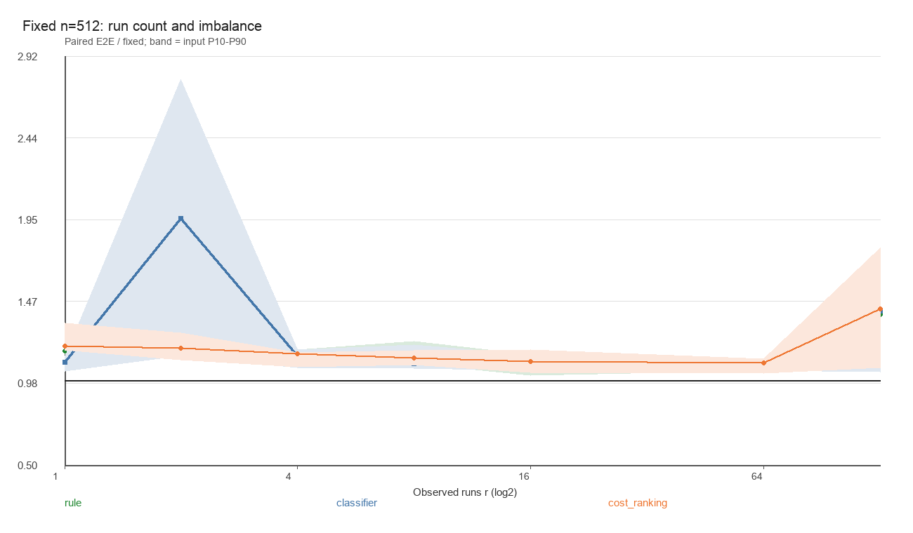

# 在线选择的收益临界点与特征开销控制：验收结论

实验已完成。**降低特征开销确实改善了本轮端到端表现，但没有得到模型稳定超过简单规则的证据，也没有找到适用于各种输入的统一长度临界点。** 本轮到此结束，不再用确认集调参。

分支：`experiment/selection-break-even`。基于完整现有工作树开展，HEAD 为 `086c581604b626101006b9dbfaa1e78e26247afa`；既有 868 个文件逐一哈希核对未变，main、stash、其他 worktree 未改，没有 commit 或 push。排序内核、规划器、七个候选及历史模型均保留原样。

完整统计和四张主图见 [findings.zh.md](findings.zh.md)，逐输入诊断见 [diagnostics.json](diagnostics.json) 与 [paired.jsonl](paired.jsonl)，验收见 [acceptance.json](acceptance.json) 和 [独立保存数据审计](saved-data-audit.json)。本文是人工判读，不替换原始记录。

## 1. 冻结模型何时有净收益

A 原样复用上轮分类树、相对成本树、抽样规则和直接执行后端。正式测量 282 个不同输入：其中 255 个属于长度／九种形态主网格，另 27 个是去重后新增的固定长度结构压力输入。以下主网格汇总不混入额外压力输入。

每输入三轮时间取中位数再相加；这不是一轮连续批处理时间。完整部署时间包括特征、推理、分派、排序和完整输出消费。

| 冻结策略 | 主网格部署时间合计 | 相对固定 runs_count |
|---|---:|---:|
| 固定 runs_count | 121.582 ms | 1.0000 |
| 固定 Hybrid-8 | 131.475 ms | 1.0814 |
| 原简单规则 | 114.748 ms | 0.9438 |
| 原分类树 | 115.643 ms | 0.9512 |
| 原成本树 | 114.678 ms | 0.9432 |

短输入的在线开销明显：n=32 时规则、分类树、成本树分别为固定策略的 1.576、1.635、1.671 倍；n=128 仍分别为 1.042、1.034、1.067 倍。按当前形态混合汇总，从 n=256 起较大已测格点的总时间比均低于 1；n=2048 约为 0.920、0.932、0.920。

**256 只是已测网格上的描述性交叉点，不能作为部署阈值。** 在 n=256 的三个种子组中，成本树仍有一组比固定策略慢；有序块结构即使增长到 n=2048，也可能没有收益。主网格逐输入配对比值的中位数仍大于 1：规则 1.075、分类树 1.067、成本树 1.073。汇总收益主要来自较昂贵输入，不能解释成多数输入都变快。

结构也重要：随机、逆序和重复值的汇总通常受益，少量长 runs、许多短 runs 等受控结构则常因本来就适合 runs_count 而没有选择收益。固定 n=512、实际 r=2 时，分类树在均衡段上的总时间比为 1.156，在偏斜段上为 2.768；r=128 的偏斜段上，规则与两种模型均约为 1.74–1.77。单凭 n 或 r 都不能概括风险。



这张图汇合均衡／偏斜输入，线为逐输入比值中位数，带为 P10–P90；具体两种结构的区别保存在 diagnostics.json。所有 run 数和长度来自实际独立扫描并与 Lean 核对，不使用生成器边界作为选择器输入。

## 2. 限制来自特征、推理，还是误选

A 中原特征独立重放平均约 24.39 μs/输入；规则、分类树、成本树推理重放平均约 0.65、0.89、2.05 μs。特征开销明显大于推理开销，且 List 上获取长度和到达分散探针需要遍历，不能因键比较预算固定就称作 O(1) 时间。

同时确实存在误选，尤其固定长度压力数据上的分类树退化。免费 Oracle 在冻结七候选内的内核时间合计为 106.963 ms，固定内核为 121.140 ms，潜在空间约 11.70%；规则／分类树／成本树所选内核分别为 109.006／110.213／108.709 ms。选择空间不为零，但规则已经获得其中相当一部分，剩余差距还要支付在线成本。

这些特征、推理和内核时间是独立重放诊断，**没有相加冒充端到端时间，也不能把重放差额当成单一组件的精确因果贡献**。本轮证据支持“短输入主要受特征开销限制，某些结构还受误选限制”；不支持将全部退化归因于一个因素。

## 3. 低开销特征是否改善表现

B 使用独立训练 172 输入、验证 86 输入、确认 129 输入，分别来自 20、10、15 个同源基础组；长度为 32、96、256、768、2048。同源派生形态整组划分，哈希去重，A 与历史数据不进入确认集。

四种预算是只用长度、最多 8 次键比较、最多 16 次、原特征最多 80 次。8/16 只提供长度、探针数和下降率；规则与模型得到同一预算的相同信息。提取先求 List.length，再沿链表单调前进获取探针，不从表头反复独立索引；没有缓存 runs，也没有改内核。

每预算真正训练了分类树和多输出相对成本回归树，各用深度 2/4、最小叶样本 8，共保存 16 个模型；有限规则网格同样只在验证集选择。全部配置于 **2026-09-08 02:34:14 UTC** 冻结，之后才生成确认集。验证集为两种模型和规则都选中 16 比较预算。

| 验证选定的部署策略 | 确认时间合计 | 相对固定 runs_count | 相对同预算规则 |
|---|---:|---:|---:|
| 固定 runs_count | 74.052 ms | 1.0000 | — |
| 16 比较规则 | 68.457 ms | 0.9244 | 1.0000 |
| 16 比较分类树 | 68.384 ms | 0.9235 | 0.9989 |
| 16 比较成本树 | 68.474 ms | 0.9247 | 1.0003 |

最清楚的特征开销对照不是跨模型的汇总，而是 **16 比较规则与 legacy 规则**：验证选中的阈值完全相同，在确认集上 129/129 个候选选择相同，内核键比较均为 440,383 次。16 比较版特征键比较为 2,064 次，legacy 为 10,320 次；端到端时间由 69.415 降至 68.457 ms，合计减少 **1.38%**。逐输入时间比中位数为 0.962，114/129 输入更快，P90 为 1.003。这是本轮实测的等决策控制，不是新证明的全输入规则等价定理。

确认集特征重放平均耗时约为：长度 4.58 μs，8 比较 9.07 μs，16 比较 12.18 μs，legacy 20.47 μs。只用长度虽然最便宜，但缺少形态信息；其模型／规则的确认汇总均未超过固定策略。

8 比较规则在确认集上为 67.560 ms，看起来比验证选中的 16 比较规则更快；**这只是保留的确认观察，没有据此换赢家或再调阈值**。各预算完整结果全部报告。不同预算重训模型的比较同时包含特征信息和所学决策的变化，不能全部归因于减少键比较。

## 4. 模型是否提供规则之外的收益

没有得到可信的额外优势。A 成本树相对规则仅约快 0.06%，分类树反而约慢 0.78%；B 验证选定的分类树相对同预算规则仅约快 0.11%，成本树约慢 0.03%。这些小差异不足以在当前样本量和计时噪声下声称模型稳定胜出。

B 的两棵获选树在确认集上的选择完全一致，仅使用抽样下降率，实际学到的是一个轻量阈值决策，并没有生成新算法。所选内核合计 66.777 ms，规则为 67.047 ms；小幅内核收益没有形成明确的部署优势。分类树／成本树推理重放约为 0.81／1.93 μs，规则约为 0.57 μs。

模型相对固定策略的约 7.5% 汇总收益也不代表普遍加速：16 比较分类树仅 44/129 个确认输入更快，配对比值中位数为 1.034、P90 为 1.379。确认集不包含 A 的额外极端不均衡压力网格，不能声称 B 已修复这些退化。

因此当前适合保留验证选定的简单 16 比较规则作为可解释基线，同时保留所有模型与负结果。下一轮若继续，优先独立验证“按长度条件化特征提取能否减少短输入开销”，而不是立即扩大模型或组合搜索。本轮没有实施这个建议，也没有把 256 或确认集赢家作为新参数。

## 5. 哪些已证明，哪些仅测得，哪些未知

**已由 Lean 检查：** 复用任意候选选择及非法／不支持输出回退的有序性、排列保持和内核成本定理；新增低预算特征的不计数、计数、比较程序语义对应，每探针恰一次键比较，总成本分别 ≤0/8/16/80；`selection_execution` 和 `selection_bound` 将特征键比较与所选内核成本组合。数值特征针对 Nat，原候选分派正确性仍覆盖任意合法 LinearOrder。

证明见 [BudgetSelection/Features.lean](../../../../LeanSort/Verification/BudgetSelection/Features.lean)，算法入口见 [特征与部署选择](../../../../LeanSort/Algorithm/BudgetSelection/Features.lean)。成本不包括元数据比较、模型计算、List 遍历、分配及机器时间；这些在线工作计入墙钟测量，但没有相应机器时间证明。

**仅检查或实测：** 训练／Lean 特征一致、导出预测一致、坏 ID／版本回退、每次排序输出与参考相同、独立键比较计数一致、所有适用成本不等式、分组与哈希无泄漏、冻结文件未改变、编译输出中的计时和结果消费、上述性能差异。编译检查确认计时路径不通过计数解释器，使用 IO 输入读取与完整结果消费防止复用；这不是编译器正确性证明。

**仍未知：** 普遍收益临界点、最快选择或最优性、不同硬件／原生编译后端上的迁移、极端未覆盖结构下低预算模型的性能，以及完整机器时间与空间保证。本轮没有算法新颖性或全局最优性的结论。

## 6. 验收、资源边界与复现

先 smoke 后正式运行，均通过。正式运行及独立保存数据审计结果：

- `lake build`、相关 Lean 检查和旧实验测试通过；20 个相关模块从本轮源码 fresh replay，45 个 Python 测试通过。
- 36 个声明完成公理审计，仅见标准 `propext`、`Quot.sound`、`Classical.choice`；新增核心证明没有 sorry、admit 或额外公理。
- 677 个不同输入／79 个基础组、70,151 条原始计时样本事件；其中包含预热的 45,032 次内核或完整策略调用逐次检查。重复轮不是独立输入。
- 1,678 个满足条件的内核记录核对相应条件界；条件不成立时不用条件定理。新旧计数与所有输出核对通过。
- 审计重放了 16 个模型的拟合并复核相同树、训练哈希及验证选择；这只是事后核验，没有覆盖模型、重新导出或改变选择。
- 全部实际执行记录状态为 ok，无测量超时／失败；未执行扩展保留 81 个设计格点及七候选的 null 成本，不填零。

本机 Apple M4 Pro、24 GiB、macOS 15.5、Lean 4.34.0-rc2，统一 `lean --run` 后端。独立 pilot 能完成 n=4096/16384，但按预定保守资源预测，正式 A 只冻结到 n=2048，保留非二次幂 96/384/768；**不是因为观察了收益后删掉大长度，也不是已经证明机器无法运行大输入**。正式请求上限 46 秒、采样 RSS 2816 MiB、栈 8 MiB，A/B 总测量预算 360/600 秒。全程记录的峰值 RSS 为 1,897,040 KiB，包含 Lean 进程，不是算法空间复杂度。未因实际尚有余额再扩充测试。

只用了三个 A 种子和三个确认种子，形态同源且存在相关性；图中带是输入间 P10–P90，不是独立样本置信区间。受控固定 runs 使用段间严格下降和值域分离，不能代表所有具有相同 n、r 的输入。较大长度和其他机器留作未完成覆盖，不外推本次结论。

从仓库根目录一键复现（每次新建结果目录，不覆盖本轮）：

```sh
python3 experiments/selection-break-even/run.py
```

可先运行 `python3 experiments/selection-break-even/run.py --smoke`。只复核本次保存证据、不重新测量或调参：

```sh
python3 experiments/selection-break-even/results/20260908T023153Z-full-c31322/audit_saved.py
```

完整输入、实际 runs、模型、候选选择、每轮原始事件、独立比较数、适用界、环境、配置与源码哈希均在本目录。实施记录与冻结决定见 [decisions.zh.log](decisions.zh.log)，可恢复状态见 [checkpoint.json](checkpoint.json)。本轮只新增 `BudgetSelection` 算法／验证模块及 `experiments/selection-break-even/`；历史源码、原始数据、失败与负结果全部保留。
